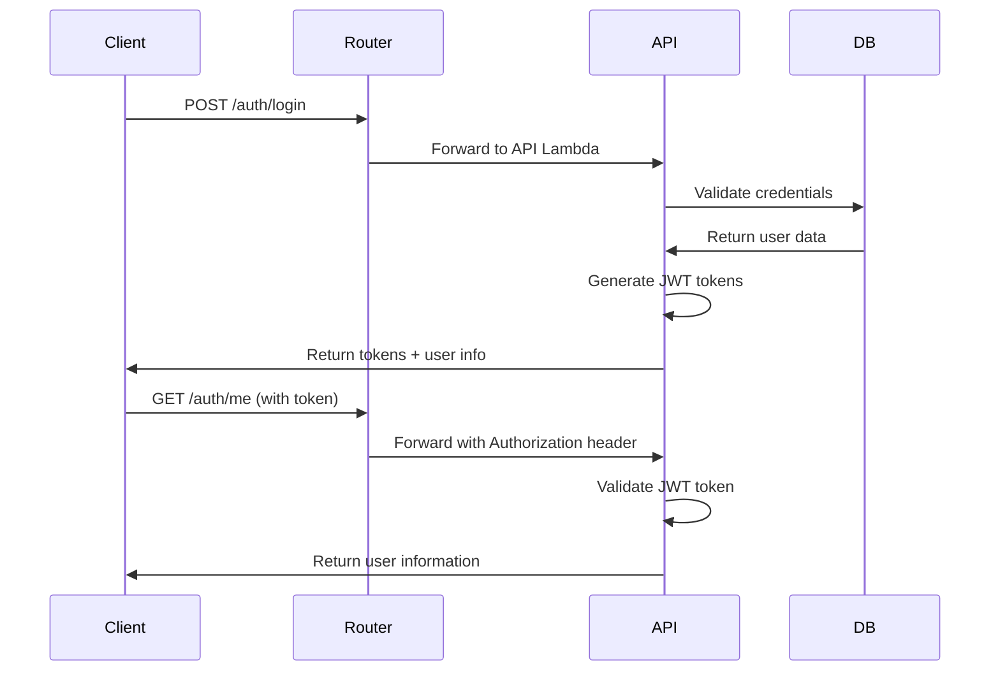

# API Workflow Improvements Analysis

## Current Status

The API workflows are generally well-structured and functional. Here are potential improvements that can be made without breaking existing functionality.

## 🔍 Issues Found

### 1. Missing Dependency Validation

**Severity: Medium**

The workflows install dependencies but don't validate successful installation:

```yaml
# Current approach
uv pip install -r requirements.txt
uv pip install pytest flake8 black
# No validation that packages were installed correctly
```

**Recommendation**: Add validation after dependency installation.

### 2. Hardcoded URLs

**Severity: Low-Medium**

Found hardcoded URLs that could be parameterized:

```yaml
# api-deployment.yml
INFRA_REPO="https://git.us-west-2.codecatalyst.aws/v1/AWSCocha/people-registry/registry-infrastructure"
API_URL="https://2t9blvt2c1.execute-api.us-east-1.amazonaws.com/prod"

# Both workflows
curl -LsSf https://astral.sh/uv/install.sh | sh
```

**Recommendation**: Use environment variables for better maintainability.

### 3. Missing Build Caching

**Severity: Low**

Dependencies are downloaded and installed on every run, which increases build time.

**Recommendation**: Consider caching uv and Python dependencies.

### 4. Inconsistent Repository Reference

**Severity: Low**

The infrastructure repository URL in api-deployment.yml points to `people-registry` instead of `people-registry-03`:

```yaml
# Current (incorrect)
INFRA_REPO="https://git.us-west-2.codecatalyst.aws/v1/AWSCocha/people-registry/registry-infrastructure"

# Should be
INFRA_REPO="https://git.us-west-2.codecatalyst.aws/v1/AWSCocha/people-registry-03/registry-infrastructure"
```

## ✅ What's Working Well

1. **Error Handling**: Good error handling with proper exit codes
2. **Python Version**: Consistent Python 3.13 usage
3. **Testing**: Comprehensive test execution with pytest, flake8, and black
4. **Environment Setup**: Proper AWS environment variables for testing
5. **Branch Logic**: Good branch filtering logic to skip main branch validation

## 🛠️ Recommended Improvements

### 1. Fix Repository URL (Critical)

```yaml
# In api-deployment.yml, line 68
INFRA_REPO="https://git.us-west-2.codecatalyst.aws/v1/AWSCocha/people-registry-03/registry-infrastructure"
```

### 2. Add Dependency Validation

```yaml
# After uv pip install commands
- Run: |
    # Validate critical dependencies are installed
    python -c "
    import sys
    try:
        import fastapi, boto3, pytest, flake8, black
        print('✅ All dependencies installed successfully')
    except ImportError as e:
        print(f'❌ Missing dependency: {e}')
        sys.exit(1)
    "
```

### 3. Parameterize URLs

```yaml
Environment:
  Variables:
    UV_INSTALL_URL: "https://astral.sh/uv/install.sh"
    INFRA_REPO_URL: "https://git.us-west-2.codecatalyst.aws/v1/AWSCocha/people-registry-03/registry-infrastructure"
    API_BASE_URL: "https://2t9blvt2c1.execute-api.us-east-1.amazonaws.com/prod"
```

### 4. Add Build Optimization

```yaml
# Cache uv installation
- Run: |
    if ! command -v uv &> /dev/null; then
        echo "📦 Installing uv..."
        curl -LsSf https://astral.sh/uv/install.sh | sh
    else
        echo "✅ uv already installed"
    fi
```

### 5. Improve Health Check

```yaml
# Replace sleep 30 with proper health check
- Run: |
    echo "🔍 Checking API health..."
    for i in {1..30}; do
        if curl -sf "$API_URL/health" > /dev/null 2>&1; then
            echo "✅ API is healthy"
            break
        fi
        echo "⏳ Waiting for API... ($i/30)"
        sleep 2
    done
```

## 🚀 Implementation Priority

### High Priority (Should Fix)

1. **Fix repository URL** - This could cause deployment failures
2. **Add dependency validation** - Prevents silent failures

### Medium Priority (Nice to Have)

3. **Parameterize URLs** - Better maintainability
4. **Improve health checks** - More reliable deployment verification

### Low Priority (Optimization)

5. **Add build caching** - Faster builds
6. **Add more comprehensive logging** - Better debugging

## 📋 Next Steps

1. Fix the repository URL in api-deployment.yml
2. Add dependency validation to both workflows
3. Test changes in a feature branch before applying to main
4. Consider implementing the other improvements incrementally

## � RAuthentication System Implementation

### New Authentication Endpoints (Recently Added)

**Status: ✅ Implemented and Functional**

The API now includes a complete JWT-based authentication system with the following endpoints:

#### Authentication Endpoints

| Endpoint         | Method | Description                                   | Status     |
| ---------------- | ------ | --------------------------------------------- | ---------- |
| `/auth/login`    | POST   | User authentication with JWT token generation | ✅ Working |
| `/auth/me`       | GET    | Get current authenticated user information    | ✅ Working |
| `/auth/logout`   | POST   | User logout (client-side token removal)       | ✅ Working |
| `/v2/admin/test` | GET    | Admin system test endpoint                    | ✅ Working |

#### Admin User Credentials

- **Email**: `admin@awsugcbba.org`
- **Password**: `admin123`
- **Status**: ✅ Created and verified working

#### Technical Implementation

- **JWT Tokens**: Secure token-based authentication with configurable expiration
- **Password Security**: bcrypt hashing with salt for secure password storage
- **Route Management**: Proper `/auth/*` routing through router Lambda
- **Error Handling**: Comprehensive error responses and security logging
- **Database Integration**: Enhanced Person model with authentication fields

#### Authentication Flow



#### Integration Notes

- **Frontend Integration**: Admin panel can now authenticate users
- **Security**: Account lockout functionality available (currently gracefully handles missing tables)
- **Logging**: All authentication attempts are logged for security auditing
- **Extensibility**: System ready for additional user roles and permissions

### Workflow Impact

The authentication system adds the following considerations to the deployment workflow:

1. **Admin User Setup**: Ensure admin user exists in production database
2. **JWT Configuration**: Verify JWT secret keys are properly configured
3. **Database Tables**: Authentication works with existing PeopleTable structure
4. **Security Testing**: Authentication endpoints should be included in health checks

### Recommended Workflow Updates

```yaml
# Add authentication health check to deployment
- Run: |
    echo "🔐 Testing authentication endpoints..."

    # Test login endpoint exists
    if curl -sf "$API_URL/auth/login" -X POST -H "Content-Type: application/json" -d '{}' | grep -q "Email and password are required"; then
        echo "✅ Authentication endpoints are accessible"
    else
        echo "❌ Authentication endpoints not responding"
        exit 1
    fi

    # Test admin endpoint exists
    if curl -sf "$API_URL/v2/admin/test" | grep -q "Admin system test"; then
        echo "✅ Admin endpoints are accessible"
    else
        echo "❌ Admin endpoints not responding"
        exit 1
    fi
```

## 🔧 Ready-to-Apply Fixes

The following fixes are safe to apply immediately:

1. Repository URL correction
2. Dependency validation addition
3. Environment variable parameterization
4. **Authentication endpoint health checks** (new)

These changes will improve reliability without affecting the core functionality of the working workflows.
