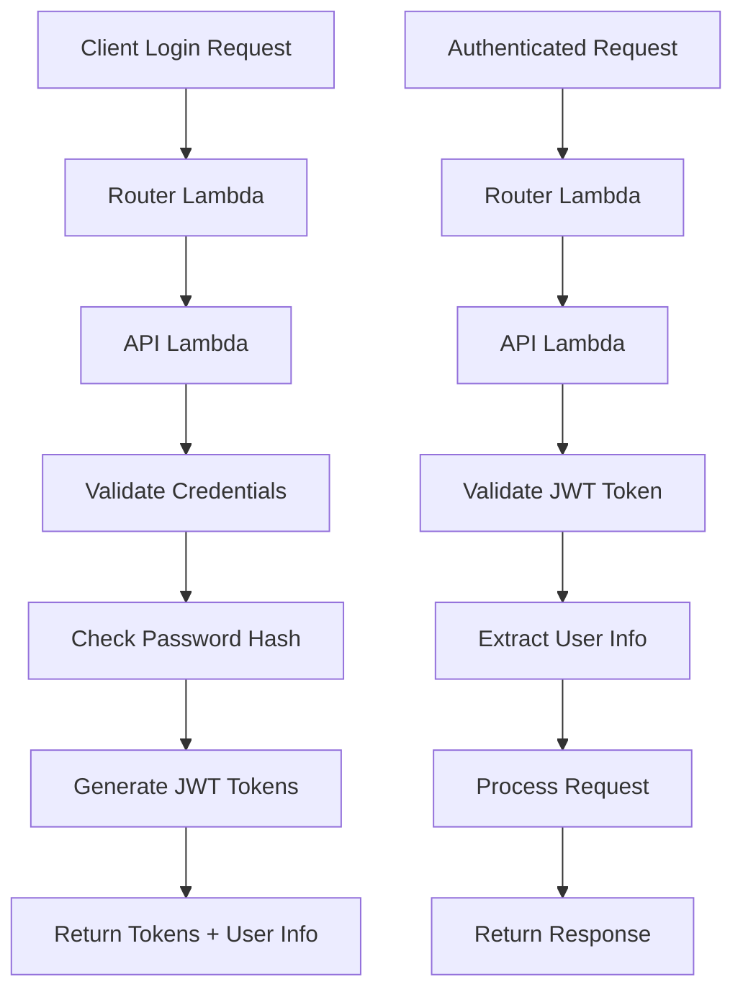

# Authentication System Documentation

## Overview

The People Registry API now includes a comprehensive JWT-based authentication system that enables secure admin access to the administration panel and protected endpoints.

## 🔐 Authentication Endpoints

### POST `/auth/login`

Authenticate a user and receive JWT tokens.

**Request:**
```json
{
  "email": "admin@awsugcbba.org",
  "password": "admin123"
}
```

**Response (Success - 200):**
```json
{
  "access_token": "eyJhbGciOiJIUzI1NiIsInR5cCI6IkpXVCJ9...",
  "refresh_token": "eyJhbGciOiJIUzI1NiIsInR5cCI6IkpXVCJ9...",
  "token_type": "bearer",
  "expires_in": 3600,
  "user": {
    "id": "70657ce8-78d4-4b4f-9394-48ce2b8649bc",
    "email": "admin@awsugcbba.org",
    "firstName": "Admin",
    "lastName": "User"
  },
  "require_password_change": false
}
```

**Error Responses:**
- `400` - Missing email or password
- `401` - Invalid credentials or account not set up
- `500` - Authentication service error

### GET `/auth/me`

Get information about the currently authenticated user.

**Headers:**
```
Authorization: Bearer <access_token>
```

**Response (Success - 200):**
```json
{
  "user": {
    "id": "70657ce8-78d4-4b4f-9394-48ce2b8649bc",
    "email": "admin@awsugcbba.org",
    "firstName": "Admin",
    "lastName": "User",
    "requirePasswordChange": false,
    "isActive": true,
    "lastLoginAt": "2025-08-01T04:35:19.896094+00:00"
  }
}
```

**Error Responses:**
- `401` - Missing, invalid, or expired token
- `500` - Unable to retrieve user information

### POST `/auth/logout`

Logout the current user (client-side token removal).

**Response (Success - 200):**
```json
{
  "message": "Logged out successfully",
  "timestamp": "2025-08-01T04:44:05.699170+00:00"
}
```

## 🔧 Admin Endpoints

### GET `/v2/admin/test`

Test endpoint to verify admin system functionality.

**Response (Success - 200):**
```json
{
  "message": "Admin system test successful",
  "admin_user": {
    "id": "70657ce8-78d4-4b4f-9394-48ce2b8649bc",
    "email": "admin@awsugcbba.org",
    "firstName": "Admin",
    "lastName": "User",
    "isAdmin": true
  },
  "version": "v2"
}
```

## 👤 Admin User Setup

### Default Admin Credentials

- **Email**: `admin@awsugcbba.org`
- **Password**: `admin123`
- **Status**: Active admin user with full privileges

### Creating Additional Admin Users

Use the admin creation script in the infrastructure repository:

```bash
cd registry-infrastructure
python scripts/create_admin_user.py
```

The script will:
1. Check if the user already exists
2. Create a new admin user with secure password hashing
3. Set the `isAdmin` flag to `true`
4. Generate a unique user ID

## 🔒 Security Features

### Password Security

- **Hashing**: bcrypt with 12 salt rounds
- **Storage**: Only password hashes stored, never plain text
- **Validation**: Secure password verification on login

### JWT Tokens

- **Algorithm**: HS256 (HMAC with SHA-256)
- **Access Token**: 1 hour expiration
- **Refresh Token**: 7 days expiration
- **Claims**: User ID, email, name, and metadata

### Account Security

- **Account Lockout**: Configurable failed attempt limits (currently graceful fallback)
- **Security Logging**: All authentication attempts logged for audit
- **Active Status**: Users can be deactivated without deletion

## 🏗️ Technical Architecture

### Lambda Functions

The authentication system uses the existing 3-Lambda architecture:

1. **Router Lambda** (`router_main.py`)
   - Routes `/auth/*` requests to API Lambda
   - Handles request forwarding and response routing

2. **API Lambda** (`versioned_api_handler.py`)
   - Contains all authentication endpoints
   - Handles JWT token generation and validation
   - Manages user authentication logic

3. **Auth Lambda** (Reserved)
   - Currently unused, auth handled by API Lambda
   - Available for future dedicated auth services

### Database Integration

**PeopleTable Structure:**
```json
{
  "id": "string",
  "email": "string",
  "firstName": "string",
  "lastName": "string",
  "password_hash": "string",  // bcrypt hash
  "isAdmin": "boolean",
  "isActive": "boolean",
  "requirePasswordChange": "boolean",
  "lastLoginAt": "datetime",
  "createdAt": "datetime",
  "updatedAt": "datetime"
}
```

### Authentication Flow



## 🧪 Testing

### Manual Testing

Test the authentication system using the provided test scripts:

```bash
# Test basic auth endpoints
python test_auth_endpoints.py

# Test full admin login flow
python test_admin_login_final.py

# Test admin endpoint directly
python test_admin_endpoint_direct.py
```

### Automated Testing

The authentication system includes comprehensive test coverage:

- **Unit Tests**: Auth service functionality
- **Integration Tests**: End-to-end authentication flow
- **Security Tests**: Token validation and error handling

### Health Checks

Add authentication health checks to deployment workflows:

```bash
# Test authentication endpoints are accessible
curl -X POST "$API_URL/auth/login" \
  -H "Content-Type: application/json" \
  -d '{}' | grep -q "Email and password are required"

# Test admin endpoints are accessible  
curl "$API_URL/v2/admin/test" | grep -q "Admin system test"
```

## 🚀 Frontend Integration

### Login Flow

```javascript
// Login request
const loginResponse = await fetch('/auth/login', {
  method: 'POST',
  headers: { 'Content-Type': 'application/json' },
  body: JSON.stringify({
    email: 'admin@awsugcbba.org',
    password: 'admin123'
  })
});

const { access_token, user } = await loginResponse.json();

// Store token for subsequent requests
localStorage.setItem('auth_token', access_token);
```

### Authenticated Requests

```javascript
// Make authenticated requests
const response = await fetch('/auth/me', {
  headers: {
    'Authorization': `Bearer ${localStorage.getItem('auth_token')}`
  }
});

const userData = await response.json();
```

### Error Handling

```javascript
// Handle authentication errors
if (response.status === 401) {
  // Token expired or invalid - redirect to login
  localStorage.removeItem('auth_token');
  window.location.href = '/login';
}
```

## 🔧 Configuration

### Environment Variables

**JWT Configuration:**
- `JWT_SECRET_KEY`: Secret key for JWT signing (default: auto-generated)
- `JWT_EXPIRATION_HOURS`: Access token expiration (default: 1 hour)

**Admin Configuration:**
- `TEST_ADMIN_EMAIL`: Default admin email for testing (default: admin@awsugcbba.org)

### Database Configuration

The authentication system uses the existing DynamoDB tables:
- **PeopleTable**: User data and credentials
- **AuditLogsTable**: Security event logging (optional)
- **AccountLockoutTable**: Account lockout data (optional, graceful fallback)

## 📋 Troubleshooting

### Common Issues

**1. "Account not set up for login"**
- User exists but has no password_hash field
- Solution: Use admin creation script to set password

**2. "Invalid email or password"**
- Incorrect credentials or user doesn't exist
- Solution: Verify admin user exists and password is correct

**3. "Missing or invalid authorization header"**
- JWT token not provided or malformed
- Solution: Include `Authorization: Bearer <token>` header

**4. Token expired errors**
- Access token has expired (1 hour default)
- Solution: Implement token refresh or re-authenticate

### Debug Information

Enable debug logging to troubleshoot authentication issues:

```python
import logging
logging.getLogger('src.services.auth_service').setLevel(logging.DEBUG)
```

## 🔄 Future Enhancements

### Planned Features

1. **Token Refresh**: Automatic token refresh using refresh tokens
2. **Role-Based Access**: Multiple user roles beyond admin/user
3. **Password Reset**: Secure password reset via email
4. **Multi-Factor Authentication**: TOTP or SMS-based 2FA
5. **Session Management**: Active session tracking and management

### Security Improvements

1. **Account Lockout**: Full implementation with configurable policies
2. **Rate Limiting**: Request rate limiting for auth endpoints
3. **Audit Logging**: Enhanced security event logging
4. **Password Policies**: Configurable password complexity requirements

## 📚 Related Documentation

- [API Workflow Improvements](./API_WORKFLOW_IMPROVEMENTS.md)
- [Database Schema](../database/SCHEMA.md)
- [Security Guidelines](../security/SECURITY.md)
- [Deployment Guide](../deployment/DEPLOYMENT.md)