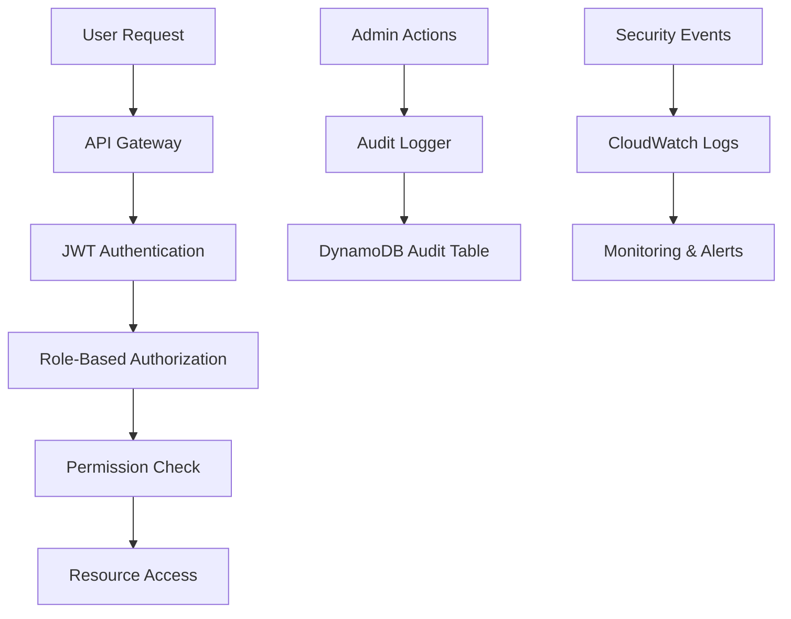

# 🔒 Security Documentation

> **Last Updated**: August 10, 2025  
> **Status**: Active Development

## 📋 Overview

This directory contains comprehensive security documentation for the People Registry application, covering authentication, authorization, access control, and security best practices.

## 📚 Documentation Index

### 🔐 Authentication & Authorization

#### [Role-Based Access Control (RBAC)](./ROLE_BASED_ACCESS_CONTROL.md)
- **Status**: ✅ Implementation Ready
- **Description**: Database-driven role and permission system
- **Key Features**:
  - Granular permission system (15+ permissions)
  - Four role types: USER, MODERATOR, ADMIN, SUPER_ADMIN
  - Complete audit trail
  - Migration from hardcoded admins

#### [Authentication System](../api/AUTHENTICATION_SYSTEM.md)
- **Status**: ✅ Production Ready
- **Description**: JWT-based authentication system
- **Key Features**:
  - JWT token authentication
  - Refresh token support
  - Admin login functionality
  - Secure password handling

### 🛡️ Security Implementation

#### [Security Best Practices](./SECURITY_BEST_PRACTICES.md)
- **Status**: 📝 In Progress
- **Description**: Comprehensive security guidelines
- **Coverage**:
  - Input validation and sanitization
  - SQL injection prevention
  - XSS protection
  - CSRF protection
  - Secure headers implementation

#### [Data Protection & Privacy](./DATA_PROTECTION.md)
- **Status**: 📝 Planned
- **Description**: Data handling and privacy compliance
- **Coverage**:
  - PII handling guidelines
  - Data encryption standards
  - GDPR compliance measures
  - Data retention policies

### 🔍 Security Monitoring

#### [Audit Logging](./AUDIT_LOGGING.md)
- **Status**: 📝 Planned
- **Description**: Comprehensive audit trail system
- **Coverage**:
  - Admin action logging
  - Security event monitoring
  - Compliance reporting
  - Log retention and analysis

#### [Security Monitoring](./SECURITY_MONITORING.md)
- **Status**: 📝 Planned
- **Description**: Real-time security monitoring
- **Coverage**:
  - Intrusion detection
  - Anomaly detection
  - Alert systems
  - Incident response procedures

## 🏗️ Security Architecture

### Current Implementation



### Security Layers

1. **Network Security**
   - API Gateway with rate limiting
   - VPC security groups
   - WAF protection

2. **Authentication Layer**
   - JWT token validation
   - Secure password hashing
   - Session management

3. **Authorization Layer**
   - Role-based access control
   - Permission-based restrictions
   - Resource-level security

4. **Data Security**
   - Encryption at rest (DynamoDB)
   - Encryption in transit (HTTPS)
   - Input validation and sanitization

5. **Audit & Monitoring**
   - Comprehensive audit logging
   - Real-time monitoring
   - Security event alerting

## 🚀 Quick Start Guide

### For Developers

1. **Authentication Setup**
   ```bash
   # Review authentication system
   cat ../api/AUTHENTICATION_SYSTEM.md
   ```

2. **Implement RBAC**
   ```bash
   # Review role-based access control
   cat ./ROLE_BASED_ACCESS_CONTROL.md
   ```

3. **Security Testing**
   ```bash
   # Run security tests
   python -m pytest tests/test_security.py -v
   ```

### For Security Teams

1. **Security Review**
   - Review all security documentation
   - Validate implementation against best practices
   - Conduct security testing

2. **Compliance Check**
   - Verify audit logging implementation
   - Review data protection measures
   - Validate access control mechanisms

3. **Monitoring Setup**
   - Configure security monitoring
   - Set up alerting systems
   - Establish incident response procedures

## 🔧 Implementation Status

### ✅ Completed Features

- **JWT Authentication System**
  - Token-based authentication
  - Secure login/logout
  - Token refresh mechanism

- **Role-Based Access Control**
  - Database-driven roles
  - Granular permissions
  - Complete audit trail

- **Basic Security Measures**
  - Input validation
  - HTTPS enforcement
  - Secure headers

### 🚧 In Progress

- **Security Best Practices Documentation**
- **Comprehensive Security Testing**
- **Advanced Audit Logging**

### 📝 Planned Features

- **Data Protection & Privacy Compliance**
- **Advanced Security Monitoring**
- **Incident Response Procedures**
- **Security Compliance Reporting**

## 🧪 Security Testing

### Test Categories

1. **Authentication Tests**
   ```bash
   python -m pytest tests/test_auth_security.py -v
   ```

2. **Authorization Tests**
   ```bash
   python -m pytest tests/test_roles_system.py -v
   ```

3. **Input Validation Tests**
   ```bash
   python -m pytest tests/test_input_validation.py -v
   ```

4. **Security Integration Tests**
   ```bash
   python -m pytest tests/test_security_integration.py -v
   ```

### Security Scanning

```bash
# Run security linting
bandit -r src/

# Check for known vulnerabilities
safety check

# Dependency security audit
pip-audit
```

## 📊 Security Metrics

### Key Performance Indicators

- **Authentication Success Rate**: > 99.5%
- **Authorization Accuracy**: 100%
- **Audit Log Completeness**: 100%
- **Security Incident Response Time**: < 15 minutes
- **Vulnerability Remediation Time**: < 24 hours

### Monitoring Dashboards

- Authentication metrics
- Authorization events
- Security incidents
- Audit log analysis
- Compliance status

## 🔗 Related Documentation

### Internal Documentation
- [API Development Guide](../api/API_DEVELOPMENT_GUIDE.md)
- [Infrastructure Security](../infrastructure/SECURITY.md)
- [Frontend Security](../frontend/SECURITY.md)

### External Resources
- [OWASP Top 10](https://owasp.org/www-project-top-ten/)
- [AWS Security Best Practices](https://aws.amazon.com/security/security-resources/)
- [JWT Security Best Practices](https://auth0.com/blog/a-look-at-the-latest-draft-for-jwt-bcp/)

## 📞 Security Contact

### Security Team
- **Security Lead**: [Contact Information]
- **Security Engineer**: [Contact Information]
- **Compliance Officer**: [Contact Information]

### Incident Reporting
- **Security Incidents**: security@awsugcbba.org
- **Vulnerability Reports**: security-reports@awsugcbba.org
- **Emergency Contact**: [Emergency Contact Information]

## 🔄 Maintenance Schedule

### Regular Reviews
- **Weekly**: Security log review
- **Monthly**: Access control audit
- **Quarterly**: Security documentation update
- **Annually**: Comprehensive security assessment

### Update Process
1. **Security Updates**: Immediate deployment
2. **Documentation Updates**: Within 48 hours of changes
3. **Compliance Reviews**: Monthly
4. **Security Training**: Quarterly

---

> **🚨 Security Notice**: This documentation contains sensitive security information. Access is restricted to authorized personnel only. Report any security concerns immediately to the security team.

**Documentation Maintained By**: Security Team  
**Review Cycle**: Monthly  
**Next Review**: September 10, 2025
