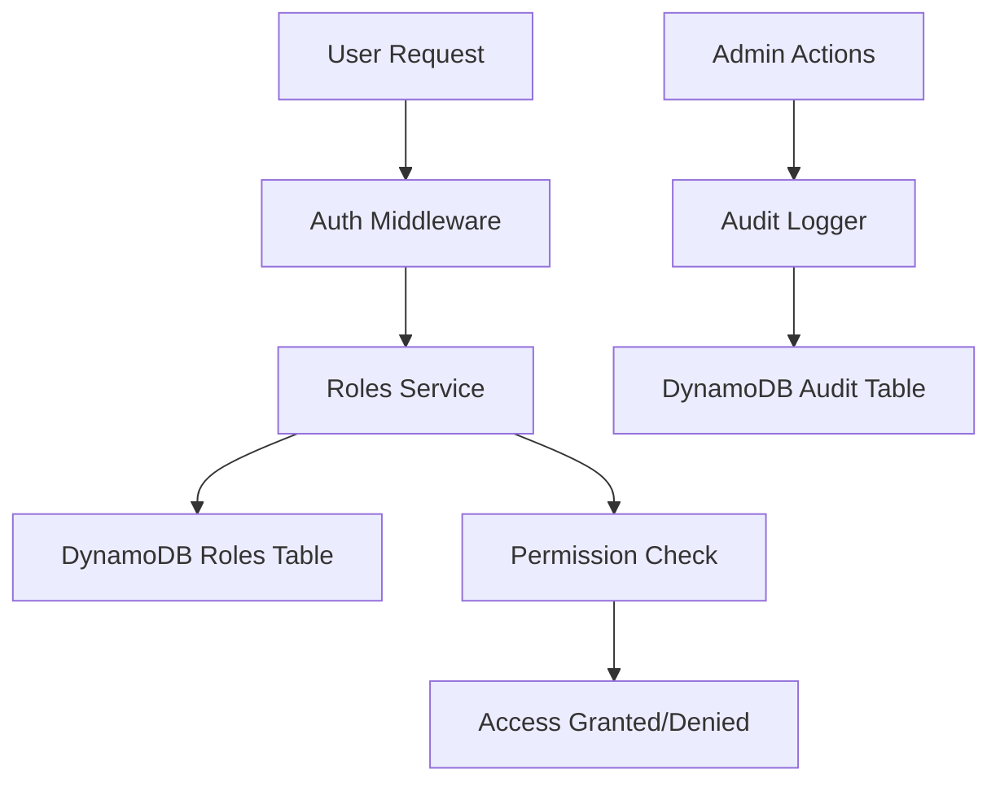

# Database-Driven Role-Based Access Control System

> **Status**: ✅ Implementation Ready  
> **Last Updated**: August 10, 2025  
> **Version**: 2.0 (Database-driven)

## 📋 Overview

This document describes the new database-driven role-based access control (RBAC) system that replaces the hardcoded admin email approach, providing a secure, scalable, and auditable access control mechanism.

### 🎯 Key Improvements

- **Security**: Eliminates hardcoded credentials from source code
- **Flexibility**: Database-driven role management
- **Granularity**: Fine-grained permission system
- **Auditability**: Complete logging of role assignments and admin actions
- **Scalability**: Easy addition of new roles and permissions

## 🏗️ Architecture

### System Components



### Core Components

1. **Role Models** (`src/models/roles.py`)
   - Defines role types, permissions, and data structures
   - Provides utility functions for role checking

2. **Roles Service** (`src/services/roles_service.py`)
   - Handles database operations for roles
   - Provides role assignment, revocation, and checking functionality

3. **Admin Middleware v2** (`src/middleware/admin_middleware_v2.py`)
   - Updated middleware using database-driven roles
   - Provides decorators for access control

4. **Role Management API** (`src/handlers/roles_handler.py`)
   - REST endpoints for managing roles
   - Admin interface for role operations

## 👥 Role Hierarchy

### Role Types and Permissions

#### 🟢 USER (Default)
- **Description**: Standard user with basic permissions
- **Use Case**: Regular application users
- **Permissions**:
  - `read_own_profile` - Read own user profile
  - `update_own_profile` - Update own user profile
  - `read_projects` - View projects
  - `create_project` - Create new projects
  - `update_own_project` - Update own projects
  - `delete_own_project` - Delete own projects

#### 🟡 MODERATOR
- **Description**: Moderator with project management permissions
- **Use Case**: Content moderators, project reviewers
- **Permissions**: All USER permissions plus:
  - `read_all_projects` - View all projects
  - `update_any_project` - Update any project

#### 🟠 ADMIN
- **Description**: Administrator with user and project management permissions
- **Use Case**: System administrators, user managers
- **Permissions**: All MODERATOR permissions plus:
  - `read_all_users` - View all users
  - `update_any_user` - Update any user
  - `delete_any_project` - Delete any project

#### 🔴 SUPER_ADMIN
- **Description**: Super administrator with full system access
- **Use Case**: System owners, security administrators
- **Permissions**: All permissions including:
  - `manage_roles` - Assign and revoke roles
  - `manage_admins` - Manage admin users
  - `system_config` - System configuration
  - `view_audit_logs` - View audit logs

### Permission Matrix

| Permission | USER | MODERATOR | ADMIN | SUPER_ADMIN |
|------------|------|-----------|-------|-------------|
| read_own_profile | ✅ | ✅ | ✅ | ✅ |
| update_own_profile | ✅ | ✅ | ✅ | ✅ |
| read_projects | ✅ | ✅ | ✅ | ✅ |
| create_project | ✅ | ✅ | ✅ | ✅ |
| update_own_project | ✅ | ✅ | ✅ | ✅ |
| delete_own_project | ✅ | ✅ | ✅ | ✅ |
| read_all_projects | ❌ | ✅ | ✅ | ✅ |
| update_any_project | ❌ | ✅ | ✅ | ✅ |
| read_all_users | ❌ | ❌ | ✅ | ✅ |
| update_any_user | ❌ | ❌ | ✅ | ✅ |
| delete_any_project | ❌ | ❌ | ✅ | ✅ |
| manage_roles | ❌ | ❌ | ❌ | ✅ |
| manage_admins | ❌ | ❌ | ❌ | ✅ |
| system_config | ❌ | ❌ | ❌ | ✅ |
| view_audit_logs | ❌ | ❌ | ❌ | ✅ |

## 🗄️ Database Schema

### Roles Table (`people-registry-roles`)

```sql
-- Primary Key Structure
Partition Key: user_id (String)
Sort Key: role_type (String)

-- Attributes
user_id: String              -- User identifier
role_type: String            -- Role type (user, admin, super_admin, etc.)
email: String                -- User email (for reference)
assigned_by: String          -- ID of user who assigned the role
assigned_at: String          -- ISO timestamp of assignment
expires_at: String           -- Optional ISO timestamp of expiration
is_active: Boolean           -- Flag for active roles
notes: String                -- Optional notes about assignment
revoked_by: String           -- ID of user who revoked role (if applicable)
revoked_at: String           -- ISO timestamp of revocation (if applicable)

-- Global Secondary Indexes
email-index: email (Hash Key)
```

### Audit Logs Table (`people-registry-audit-logs`)

```sql
-- Primary Key Structure
Partition Key: log_id (String)

-- Attributes
log_id: String               -- Unique log identifier (UUID)
timestamp: String            -- ISO timestamp of action
admin_user_id: String        -- ID of admin who performed action
admin_user_email: String     -- Email of admin user
admin_user_roles: List       -- Roles of admin user at time of action
action: String               -- Action performed (ASSIGN_ROLE, DELETE_USER, etc.)
target_resource: String      -- Type of resource affected (user, project, etc.)
target_id: String            -- ID of affected resource
success: Boolean             -- Whether action was successful
details: Map                 -- Additional action details

-- Global Secondary Indexes
timestamp-index: timestamp (Hash Key)
admin-user-index: admin_user_id (Hash Key), timestamp (Range Key)
```

## 🚀 Implementation Guide

### Step 1: Database Setup

Create the required DynamoDB tables:

```bash
cd registry-infrastructure/scripts
python create_roles_table.py
```

This creates:
- `people-registry-roles` table with proper indexes
- `people-registry-audit-logs` table for audit trail

### Step 2: Migration from Hardcoded Admins

Run the migration script to move existing hardcoded admins to database:

```bash
cd registry-api/scripts
python migrate_admin_roles.py
```

**Migrated Admins:**
- `admin@cbba.cloud.org.bo` → SUPER_ADMIN
- `admin@awsugcbba.org` → SUPER_ADMIN  
- `sergio.rodriguez.inclan@gmail.com` → SUPER_ADMIN

### Step 3: Update Application Code

Replace imports of the old middleware:

```python
# ❌ Old approach
from src.middleware.admin_middleware import require_admin_access

# ✅ New approach
from src.middleware.admin_middleware_v2 import require_admin_access
```

### Step 4: Verification and Testing

Run comprehensive tests:

```bash
cd registry-api
python -m pytest tests/test_roles_system.py -v
```

## 💻 Usage Examples

### Role-Based Endpoint Protection

```python
from fastapi import APIRouter, Depends
from src.middleware.admin_middleware_v2 import (
    require_admin_access,
    require_super_admin_access,
    require_permission
)
from src.models.roles import Permission

router = APIRouter()

# Require admin role
@router.get("/admin-dashboard")
async def admin_dashboard(
    current_user = Depends(require_admin_access)
):
    return {"message": "Admin access granted"}

# Require super admin role
@router.post("/system-config")
async def update_system_config(
    config: dict,
    current_user = Depends(require_super_admin_access)
):
    return {"message": "System configuration updated"}

# Require specific permission
@router.get("/users")
async def list_all_users(
    current_user = Depends(require_permission(Permission.READ_ALL_USERS))
):
    return {"users": []}
```

### Programmatic Role Management

```python
from src.services.roles_service import RolesService
from src.models.roles import RoleType, Permission, RoleAssignmentRequest

roles_service = RolesService()

# Check if user is admin
is_admin = await roles_service.user_is_admin("user123")

# Check specific permission
has_permission = await roles_service.user_has_permission(
    "user123", 
    Permission.READ_ALL_USERS
)

# Assign role
request = RoleAssignmentRequest(
    user_email="user@example.com",
    role_type=RoleType.ADMIN,
    notes="Promoted to admin role"
)
response = await roles_service.assign_role(request, "admin_user_id")
```

## 🔌 API Endpoints

### Role Management Endpoints

#### GET `/api/v1/roles/`
List all available roles and permissions (Admin required)

#### GET `/api/v1/roles/user/{user_id}`
Get detailed role information for a user (Admin required)

#### POST `/api/v1/roles/assign`
Assign role to user (Super Admin required)

```json
{
    "user_email": "user@example.com",
    "role_type": "admin",
    "notes": "Promoted to admin",
    "expires_at": "2024-12-31T23:59:59Z"
}
```

#### POST `/api/v1/roles/revoke`
Revoke role from user (Super Admin required)

```json
{
    "user_email": "user@example.com",
    "role_type": "admin"
}
```

#### GET `/api/v1/roles/my-roles`
Get current user's roles (Authentication required)

#### GET `/api/v1/roles/check-permission/{permission}`
Check if current user has specific permission

#### POST `/api/v1/roles/migrate-existing-admins`
One-time migration endpoint for hardcoded admins (Super Admin required)

## 🔒 Security Considerations

### Best Practices

1. **Principle of Least Privilege**
   - Assign minimum required permissions
   - Regular role reviews and cleanup
   - Use role expiration for temporary access

2. **Audit Trail**
   - All role changes are automatically logged
   - Admin actions include full context
   - Immutable audit log for compliance

3. **Access Control**
   - Super Admin operations require highest privileges
   - Role assignments require proper authorization
   - Self-service limited to viewing own roles

4. **Data Protection**
   - No sensitive data in source code
   - Encrypted data at rest in DynamoDB
   - Secure token-based authentication

### Security Features

- ✅ **No hardcoded credentials** in source code
- ✅ **Granular permission system** with 15+ permissions
- ✅ **Complete audit trail** of all role changes
- ✅ **Role expiration support** for temporary access
- ✅ **Immutable audit logs** for compliance
- ✅ **Principle of least privilege** enforcement

## 🧪 Testing Strategy

### Test Coverage

The comprehensive test suite covers:

1. **Unit Tests**
   - Role model functionality
   - Permission checking logic
   - Database operations
   - Middleware access control

2. **Integration Tests**
   - End-to-end role assignment flow
   - API endpoint functionality
   - Database integration

3. **Security Tests**
   - Access control validation
   - Permission boundary testing
   - Audit trail verification

### Running Tests

```bash
# Run all role system tests
python -m pytest tests/test_roles_system.py -v

# Run with coverage
python -m pytest tests/test_roles_system.py --cov=src/models/roles --cov=src/services/roles_service --cov=src/middleware/admin_middleware_v2
```

## 🔧 Troubleshooting

### Common Issues

#### Migration Fails
**Symptoms**: Migration script reports errors
**Solutions**:
- Ensure DynamoDB tables exist: `python create_roles_table.py`
- Check AWS credentials and permissions
- Verify user records exist in users table

#### Permission Denied Errors
**Symptoms**: 403 Forbidden responses
**Solutions**:
- Check user has required role in database
- Verify role is active and not expired
- Confirm middleware is using v2 version

#### Role Assignment Fails
**Symptoms**: Role assignment API returns errors
**Solutions**:
- Ensure target user exists in system
- Check assigning user has super admin privileges
- Verify DynamoDB write permissions

### Debug Mode

Enable detailed logging:

```python
import logging

# Enable debug logging for roles system
logging.getLogger('src.services.roles_service').setLevel(logging.DEBUG)
logging.getLogger('src.middleware.admin_middleware_v2').setLevel(logging.DEBUG)
```

## 🚀 Future Enhancements

### Planned Features

1. **Role Hierarchies**
   - Implement role inheritance
   - Parent-child role relationships
   - Automatic permission inheritance

2. **Resource-Specific Permissions**
   - Permissions tied to specific resources
   - Project-level access control
   - User-specific permissions

3. **Time-Based Access**
   - Scheduled role activation/deactivation
   - Business hours access control
   - Temporary elevated permissions

4. **External Identity Integration**
   - SAML/OIDC integration
   - Active Directory synchronization
   - Multi-factor authentication

5. **Advanced Audit Dashboard**
   - Web interface for audit log analysis
   - Role usage analytics
   - Security compliance reporting

### Extensibility Points

The system is designed for easy extension:

```python
# Add new role types
class RoleType(str, Enum):
    USER = "user"
    MODERATOR = "moderator"
    ADMIN = "admin"
    SUPER_ADMIN = "super_admin"
    CUSTOM_ROLE = "custom_role"  # New role

# Add new permissions
class Permission(str, Enum):
    # Existing permissions...
    CUSTOM_PERMISSION = "custom_permission"  # New permission

# Update role configurations
DEFAULT_ROLES[RoleType.CUSTOM_ROLE] = Role(
    role_type=RoleType.CUSTOM_ROLE,
    permissions={Permission.CUSTOM_PERMISSION},
    description="Custom role with specific permissions"
)
```

## 🔧 Troubleshooting

### Common Issues

#### Admin Access Denied Despite Valid Roles

**Symptoms**:
- `/auth/me` returns `"isAdmin": false`
- Admin endpoints return 403 "Insufficient privileges"
- User has valid roles in database

**Cause**: Role format case sensitivity mismatch between database and enum

**Solution**: Fixed in `fix/rbac-case-insensitive-roles` (2025-08-11)
- Added `_normalize_role_type()` method to handle case variations
- Supports both `"ADMIN"` (database) and `"admin"` (enum) formats
- Backward compatible with all existing role formats

**Verification**:
```bash
# Check user roles in database
aws dynamodb query --table-name people-registry-roles \
  --key-condition-expression "user_id = :uid" \
  --expression-attribute-values '{":uid":{"S":"USER_ID_HERE"}}'

# Test admin login
curl -X POST "https://api.awsugcbba.org/auth/user/login" \
  -d '{"email":"admin@awsugcbba.org","password":"PASSWORD"}'
```

#### Role Assignment Not Taking Effect

**Symptoms**:
- Role appears in database but user still lacks permissions
- `user_is_admin()` returns false for admin users

**Common Causes**:
1. **Inactive Role**: Check `is_active` field is `true`
2. **Expired Role**: Check `expires_at` is null or future date
3. **Cache Issues**: JWT tokens cache old role information

**Solutions**:
```python
# Check role status
role_item = {
    "is_active": True,  # Must be true
    "expires_at": None  # Or future timestamp
}

# Force token refresh
# User must login again to get updated roles
```

### Debugging Commands

```bash
# Check all roles for a user
aws dynamodb query --table-name people-registry-roles \
  --key-condition-expression "user_id = :uid" \
  --expression-attribute-values '{":uid":{"S":"USER_ID"}}'

# Check role by email
aws dynamodb query --table-name people-registry-roles \
  --index-name email-index \
  --key-condition-expression "email = :email" \
  --expression-attribute-values '{":email":{"S":"user@example.com"}}'

# Test role normalization
python -c "
from src.services.roles_service import RolesService
rs = RolesService()
print(rs._normalize_role_type('ADMIN'))  # Should return RoleType.ADMIN
"
```

## 📚 Related Documentation

- [Authentication System](../api/AUTHENTICATION_SYSTEM.md) - JWT-based authentication
- [API Development Guide](../api/API_DEVELOPMENT_GUIDE.md) - API development best practices
- [Security Best Practices](./SECURITY_BEST_PRACTICES.md) - General security guidelines
- [RBAC Case Sensitivity Fix](../fixes/RBAC_CASE_SENSITIVITY_FIX.md) - Detailed fix documentation

## 📞 Support

For questions or issues with the roles system:

1. **Documentation**: Review this guide and related docs
2. **Testing**: Check test cases for usage examples
3. **Logs**: Review application logs for error details
4. **Team**: Contact the development team for assistance

---

> **⚠️ Important**: This system completely replaces the hardcoded admin email approach. Ensure proper migration and testing before removing the old middleware from production systems.

**Implementation Status**: ✅ Ready for deployment  
**Security Review**: ✅ Completed  
**Testing**: ✅ Comprehensive test suite included
