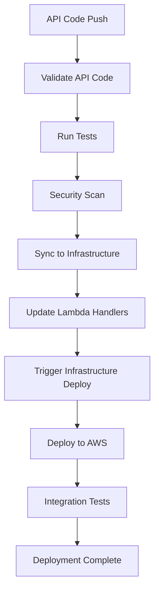

# Design Document

## Overview

This design document outlines the completion of CRUD operations for persons in the microservices web application. The system already has basic CRUD functionality implemented, but requires enhancements for password management, improved validation, security features, and better error handling. The design builds upon the existing FastAPI-based architecture with DynamoDB storage, JWT authentication, and comprehensive security measures.

## Architecture

### Current Architecture Components
- **FastAPI Application**: RESTful API with automatic OpenAPI documentation
- **DynamoDB Service**: Data persistence layer with person, project, and subscription tables
- **Authentication Service**: JWT-based authentication with account lockout protection
- **Password Utilities**: Secure password hashing using bcrypt with policy enforcement
- **JWT Utilities**: Token generation and validation for stateless authentication
- **Middleware**: Authentication middleware for protecting endpoints

### Enhanced Architecture Components
- **Password Management Service**: New service for secure password updates and validation
- **Email Verification Service**: Service for handling email change verification
- **Audit Service**: Enhanced logging for all person operations
- **Validation Service**: Centralized validation for person data with detailed error messages
- **Rate Limiting Service**: Protection against abuse and brute force attacks

## Components and Interfaces

### 1. Enhanced Person Handler

The existing `people_handler.py` will be enhanced with new endpoints and improved error handling:

```python
# New endpoints to be added:
@app.put("/people/{person_id}/password")  # Password update
@app.post("/people/{person_id}/verify-email")  # Email verification
@app.get("/people/search")  # Search with filters
@app.post("/people/{person_id}/unlock")  # Admin unlock account
```

### 2. Password Management Service

New service `password_management_service.py` for handling password operations:

```python
class PasswordManagementService:
    async def update_password(person_id: str, current_password: str, new_password: str) -> bool
    async def validate_password_change_request(person_id: str, current_password: str) -> bool
    async def force_password_change(person_id: str) -> bool
    async def generate_temporary_password(person_id: str) -> str
```

### 3. Enhanced Person Models

Extension of existing person models with password-related fields:

```python
class PasswordUpdateRequest(BaseModel):
    current_password: str
    new_password: str
    confirm_password: str

class PersonSearchRequest(BaseModel):
    email: Optional[str] = None
    first_name: Optional[str] = None
    last_name: Optional[str] = None
    phone: Optional[str] = None
    limit: int = 100
    offset: int = 0
```

### 4. Email Verification Service

New service for handling email change verification:

```python
class EmailVerificationService:
    async def initiate_email_change(person_id: str, new_email: str) -> str
    async def verify_email_change(verification_token: str) -> bool
    async def send_verification_emails(old_email: str, new_email: str, token: str) -> bool
```

### 5. Enhanced Validation Service

Centralized validation with detailed error messages:

```python
class PersonValidationService:
    async def validate_person_create(person_data: PersonCreate) -> ValidationResult
    async def validate_person_update(person_id: str, person_data: PersonUpdate) -> ValidationResult
    async def validate_email_uniqueness(email: str, exclude_person_id: str = None) -> bool
    async def validate_phone_format(phone: str) -> bool
    async def validate_date_of_birth(date_str: str) -> bool
```

## Data Models

### Enhanced Person Model

The existing Person model will be extended with additional fields for password management:

```python
class Person(PersonBase):
    id: str
    created_at: datetime
    updated_at: datetime
    
    # Password-related fields (optional, for authentication)
    password_hash: Optional[str] = None
    password_salt: Optional[str] = None
    require_password_change: bool = False
    last_password_change: Optional[datetime] = None
    password_history: List[str] = []
    
    # Account security fields
    failed_login_attempts: int = 0
    account_locked_until: Optional[datetime] = None
    last_login_at: Optional[datetime] = None
    is_active: bool = True
    
    # Email verification fields
    email_verified: bool = False
    email_verification_token: Optional[str] = None
    pending_email_change: Optional[str] = None
```

### New Request/Response Models

```python
class PasswordUpdateRequest(BaseModel):
    current_password: str = Field(..., min_length=1)
    new_password: str = Field(..., min_length=8)
    confirm_password: str = Field(..., min_length=8)

class PersonSearchResponse(BaseModel):
    people: List[PersonResponse]
    total_count: int
    page: int
    page_size: int
    has_more: bool

class ValidationError(BaseModel):
    field: str
    message: str
    code: str

class ErrorResponse(BaseModel):
    error: str
    message: str
    details: Optional[List[ValidationError]] = None
    timestamp: datetime
    request_id: str
```

## Error Handling

### Structured Error Responses

All endpoints will return consistent error responses with appropriate HTTP status codes:

- **400 Bad Request**: Validation errors with field-specific messages
- **401 Unauthorized**: Authentication failures
- **403 Forbidden**: Authorization failures (e.g., password change required)
- **404 Not Found**: Resource not found
- **409 Conflict**: Constraint violations (e.g., email already exists)
- **429 Too Many Requests**: Rate limiting exceeded
- **500 Internal Server Error**: Unexpected server errors

### Error Response Format

```json
{
  "error": "VALIDATION_ERROR",
  "message": "The request contains invalid data",
  "details": [
    {
      "field": "email",
      "message": "Email address is already in use",
      "code": "EMAIL_ALREADY_EXISTS"
    }
  ],
  "timestamp": "2025-01-22T10:30:00Z",
  "request_id": "req_123456789"
}
```

### Logging Strategy

- **Security Events**: All authentication and authorization events
- **Data Changes**: All person data modifications with before/after values
- **Error Events**: All errors with sufficient context for debugging
- **Performance Events**: Slow queries and operations

## Testing Strategy

### Unit Tests

- **Password Management**: Test password validation, hashing, and history management
- **Validation Services**: Test all validation rules and edge cases
- **Model Serialization**: Test request/response model validation
- **Utility Functions**: Test JWT, password, and validation utilities

### Integration Tests

- **API Endpoints**: Test all CRUD operations with various scenarios
- **Authentication Flow**: Test login, token refresh, and password changes
- **Database Operations**: Test DynamoDB operations with mocked AWS services
- **Error Handling**: Test error responses and status codes

### Security Tests

- **Password Security**: Test password policy enforcement and history
- **Authentication**: Test JWT token validation and expiration
- **Authorization**: Test access control and permission checks
- **Rate Limiting**: Test protection against abuse

### End-to-End Tests

- **Complete User Flows**: Test registration, login, profile updates, password changes
- **Cross-Service Integration**: Test interactions between API, frontend, and infrastructure
- **Error Scenarios**: Test system behavior under various failure conditions

## Security Considerations

### Password Security

- **Bcrypt Hashing**: Use bcrypt with 12 salt rounds for password hashing
- **Password Policy**: Enforce complexity requirements and prevent reuse
- **Password History**: Store hashed versions of last 5 passwords
- **Secure Transmission**: Ensure passwords are only sent over HTTPS

### Authentication Security

- **JWT Tokens**: Short-lived access tokens (1 hour) with longer refresh tokens (7 days)
- **Token Invalidation**: Invalidate tokens on password change
- **Account Lockout**: Lock accounts after 5 failed login attempts for 15 minutes
- **Session Management**: Track login attempts and suspicious activity

### Data Protection

- **Sensitive Data**: Never log or return password hashes in API responses
- **Email Verification**: Secure email change process with verification tokens
- **Audit Trail**: Comprehensive logging of all security-related events
- **Rate Limiting**: Protect against brute force and abuse attacks

## Development Environment

### Dependency Management

The project uses **devbox** for consistent development environments across all three projects:

- **Root Project**: Python 3.x, uv, git
- **Registry API**: Python 3.x, uv (for Python dependencies)
- **Registry Frontend**: Node.js, just, AWS CLI, git
- **Registry Infrastructure**: Python 3.13, Node.js, AWS CLI, git, uv (with automatic venv setup)

**Important Notes**:
- Use `uv` for all Python dependency management instead of pip
- CDK should be installed on the host system (not through devbox) due to version constraints
- Each project has its own devbox environment for isolation
- Infrastructure project automatically sets up Python virtual environment

### Development Workflow

```bash
# Enter devbox environment for API development
cd registry-api && devbox shell

# Install Python dependencies with uv
uv add <package-name>

# For infrastructure (CDK should be installed on host)
cd registry-infrastructure && devbox shell
# CDK commands run directly on host: cdk deploy, cdk synth, etc.
```

## Development Environment

### Dependency Management

The project uses **devbox** for consistent development environments across all three projects:

- **Root Project**: Python 3.x, uv, git
- **Registry API**: Python 3.x, uv (for Python dependencies)
- **Registry Frontend**: Node.js, just, AWS CLI, git
- **Registry Infrastructure**: Python 3.13, Node.js, AWS CLI, git, uv (with automatic venv setup)

**Important Notes**:
- Use `uv` for all Python dependency management instead of pip
- CDK should be installed on the host system (not through devbox) due to version constraints
- Each project has its own devbox environment for isolation
- Infrastructure project automatically sets up Python virtual environment

### Development Workflow

```bash
# Enter devbox environment for API development
cd registry-api && devbox shell

# Install Python dependencies with uv
uv add <package-name>

# For infrastructure (CDK should be installed on host)
cd registry-infrastructure && devbox shell
# CDK commands run directly on host: cdk deploy, cdk synth, etc.
```

## Performance Considerations

### Database Optimization

- **Efficient Queries**: Use DynamoDB best practices for queries and scans
- **Pagination**: Implement cursor-based pagination for large result sets
- **Caching**: Consider caching frequently accessed person data
- **Connection Pooling**: Optimize database connection management

### API Performance

- **Response Compression**: Enable gzip compression for API responses
- **Async Operations**: Use async/await for all I/O operations
- **Request Validation**: Validate requests early to avoid unnecessary processing
- **Error Handling**: Fast-fail on validation errors

### Monitoring and Metrics

- **Response Times**: Monitor API endpoint response times
- **Error Rates**: Track error rates and types
- **Authentication Metrics**: Monitor login success/failure rates
- **Database Performance**: Track DynamoDB read/write capacity usage

## Implementation Phases

### Phase 1: Core Enhancements
- Enhanced password management endpoints
- Improved validation with detailed error messages
- Comprehensive error handling and logging

### Phase 2: Security Features
- Email verification for email changes
- Enhanced audit logging
- Rate limiting implementation

### Phase 3: Advanced Features
- Person search with filtering
- Admin functions (account unlock)
- Performance optimizations

### Phase 4: Testing and Documentation
- Comprehensive test suite
- API documentation updates
- Security testing and validation

## Deployment Workflow Design

### Current Deployment Architecture

The current deployment strategy uses a centralized approach where:
- **Registry-Infrastructure**: Contains Lambda code and handles API deployment
- **Registry-Frontend**: Has its own CodeCatalyst workflows for frontend deployment
- **Registry-API**: No deployment workflows (code deployed via infrastructure)

### Proposed Deployment Workflow Architecture

#### 1. Registry-API Deployment Workflow

Create CodeCatalyst workflows in the registry-api repository to handle:

```yaml
# .codecatalyst/workflows/api-deployment.yml
Name: API_Deployment_Pipeline
Triggers:
  - Type: PUSH
    Branches: [main]
  - Type: PULLREQUEST
    Branches: [main]
    Events: [OPEN, REVISION]

Actions:
  ValidateAPI:
    - Run tests and code quality checks
    - Validate Python code with linting
    - Check security vulnerabilities
    
  SyncToInfrastructure:
    - Copy API code to infrastructure repository
    - Update Lambda handlers with new endpoints
    - Synchronize dependencies and requirements
    
  TriggerInfrastructureDeployment:
    - Trigger infrastructure deployment workflow
    - Pass deployment context and metadata
    - Coordinate cross-repository deployment
```

#### 2. Cross-Repository Coordination

Implement automated synchronization between repositories:

- **Code Synchronization**: Automatically sync API code to infrastructure Lambda directory
- **Dependency Management**: Update requirements.txt in infrastructure when API dependencies change
- **Handler Integration**: Automatically integrate new API endpoints into Lambda handlers
- **Deployment Coordination**: Trigger infrastructure deployment after successful API validation

#### 3. Deployment Validation Pipeline



#### 4. Security and Quality Gates

- **Code Quality**: ESLint, Pylint, and security scanning
- **Test Coverage**: Minimum 80% test coverage requirement
- **Security Scanning**: Dependency vulnerability checks
- **Integration Testing**: End-to-end API testing after deployment

#### 5. Rollback and Recovery

- **Automated Rollback**: Rollback on deployment failure
- **Health Checks**: Post-deployment health verification
- **Monitoring Integration**: CloudWatch alarms and notifications
- **Manual Override**: Emergency deployment capabilities

### Implementation Strategy

#### Phase 1: Basic Workflow Setup
- Create CodeCatalyst workflow files in registry-api
- Implement basic validation and testing pipeline
- Set up cross-repository triggers

#### Phase 2: Code Synchronization
- Implement automated code sync to infrastructure
- Update Lambda handler integration
- Add dependency management automation

#### Phase 3: Advanced Features
- Add security scanning and quality gates
- Implement rollback mechanisms
- Add monitoring and alerting integration

#### Phase 4: Optimization
- Optimize deployment performance
- Add advanced testing strategies
- Implement blue-green deployment patterns