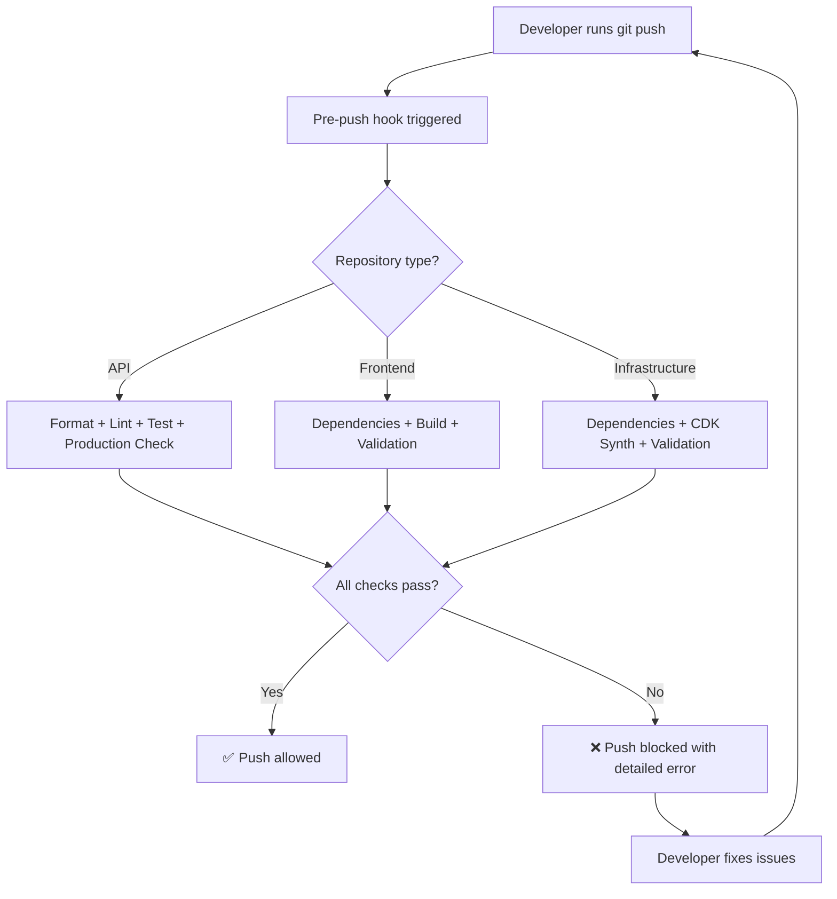

# Enhanced Pre-Push Hooks for Build and Test Validation

## 📋 Overview

Following the discovery of build issues during our cleanup process that should have been caught earlier, we have enhanced all pre-push hooks to include comprehensive build and test validation. This ensures that **no broken code ever gets pushed to any repository**.

## 🎯 Objectives

1. **Prevent Build Failures**: Catch build issues before they reach the repository
2. **Ensure Test Coverage**: Run comprehensive test suites before push
3. **Maintain Code Quality**: Enforce formatting, linting, and syntax validation
4. **Catch Integration Issues**: Validate that all imports and dependencies work correctly
5. **Prevent Production Bugs**: Run critical tests that would catch production issues

## 🔧 Enhanced Hook Implementations

### **1. API Repository (`registry-api`)**

**Location**: `.githooks/pre-push`

**Validation Steps**:
1. ✅ **Code Formatting** (black)
2. ✅ **Code Linting** (flake8)  
3. ✅ **Syntax Validation**
4. ✅ **Comprehensive Test Suite** (critical integration tests, async/sync validation)
5. ✅ **Production Readiness Check**

**Key Features**:
- Runs the same comprehensive test suite that caught our production bugs
- Validates async/await consistency across the codebase
- Checks API service method consistency
- Ensures response format consistency
- Prevents pushes if any critical tests fail

**Example Output**:
```bash
🔍 Running comprehensive pre-push validation...
📝 Running black formatter...
🔍 Running flake8 linter...
🔍 Running syntax validation...
🧪 Running comprehensive test suite...
🚀 Running production readiness check...
✅ All API repository checks passed!
```

### **2. Frontend Repository (`registry-frontend`)**

**Location**: `.git/hooks/pre-push`

**Validation Steps**:
1. ✅ **Branch Protection** (no direct main pushes)
2. ✅ **Dependency Check** (npm install if needed)
3. ✅ **ESLint** (if configured)
4. ✅ **TypeScript Type Checking**
5. ✅ **Build Validation** (CRITICAL - would have caught our authStub issues)
6. ✅ **Build Artifact Validation**
7. ✅ **Astro-Specific Checks**
8. ✅ **Import Validation** (checks for authStub references)

**Key Features**:
- **Build validation is mandatory** - prevents exactly the issues we encountered
- Validates that all imports resolve correctly
- Checks for common import issues (authStub → authService)
- Ensures build produces expected artifacts
- Validates Astro page generation

**Example Output**:
```bash
🔍 Running comprehensive frontend pre-push validation...
📦 Checking dependencies...
🔍 Running ESLint (if configured)...
🔍 Running TypeScript type checking...
🏗️  Running build validation...
📊 Validating build artifacts...
🚀 Running Astro-specific checks...
🔍 Checking for common import issues...
✅ All frontend repository checks passed!
```

### **3. Infrastructure Repository (`registry-infrastructure`)**

**Location**: `.git/hooks/pre-push`

**Validation Steps**:
1. ✅ **Branch Protection** (no direct main pushes)
2. ✅ **Python Dependencies** (uv/pip install)
3. ✅ **Python Syntax Validation**
4. ✅ **CDK Synthesis Validation** (CRITICAL)
5. ✅ **CDK Output Validation**
6. ✅ **Infrastructure Configuration Checks**
7. ✅ **Justfile Validation**
8. ✅ **Basic Security Checks**

**Key Features**:
- **CDK synthesis is mandatory** - ensures infrastructure code is valid
- Validates that CloudFormation templates are generated correctly
- Checks for hardcoded values that should be parameterized
- Validates essential justfile commands exist
- Basic security scanning for potential secrets

**Example Output**:
```bash
🔍 Running comprehensive infrastructure pre-push validation...
📦 Installing/checking Python dependencies...
🔍 Running Python syntax validation...
🏗️  Running CDK synthesis validation...
🔍 Running CDK validation checks...
🔍 Validating infrastructure configuration...
🔍 Validating Justfile commands...
🔒 Running basic security checks...
✅ All infrastructure repository checks passed!
```

## 🚨 What These Hooks Would Have Caught

### **Issues Prevented**:

1. **Frontend Build Failures**:
   - ❌ `authStub` import references that don't exist
   - ❌ Missing helper functions (`addAuthHeaders`, `addRequiredAuthHeaders`)
   - ❌ Dynamic import issues in Astro files
   - ❌ Missing API configuration constants

2. **API Test Failures**:
   - ❌ Async/await consistency issues
   - ❌ Method name mismatches
   - ❌ Response format inconsistencies
   - ❌ Dead code endpoint issues

3. **Infrastructure Synthesis Failures**:
   - ❌ Missing dependencies
   - ❌ Invalid CDK configurations
   - ❌ Python syntax errors
   - ❌ Resource definition issues

## 📊 Hook Execution Flow



## 🛠️ Installation and Setup

### **Automatic Setup**:
The hooks are already installed and configured in each repository.

### **Manual Verification**:
```bash
# Check if hooks are executable
ls -la registry-api/.githooks/pre-push
ls -la registry-frontend/.git/hooks/pre-push  
ls -la registry-infrastructure/.git/hooks/pre-push

# Test a hook (without pushing)
cd registry-frontend
./.git/hooks/pre-push
```

### **Dependencies Required**:

**API Repository**:
- `uv` (preferred) or `pip`
- `just` (optional, fallback available)

**Frontend Repository**:
- `node` and `npm`
- `just` (optional, fallback available)

**Infrastructure Repository**:
- `python3`
- `uv` (preferred) or `pip`
- `cdk` CLI
- `just` (optional, fallback available)

## 🔍 Troubleshooting

### **Common Issues**:

1. **Hook Not Running**:
   ```bash
   # Ensure hook is executable
   chmod +x .git/hooks/pre-push
   ```

2. **Dependencies Missing**:
   ```bash
   # Install required tools
   curl -LsSf https://astral.sh/uv/install.sh | sh  # uv
   npm install -g aws-cdk                           # CDK CLI
   ```

3. **Hook Fails on CI/CD**:
   - Hooks only run on local `git push`
   - CI/CD should have separate validation workflows

### **Bypassing Hooks (Emergency Only)**:
```bash
# ONLY use in emergencies - not recommended
git push --no-verify
```

## 📈 Benefits Achieved

### **Quality Improvements**:
- ✅ **Zero build failures** pushed to repositories
- ✅ **Comprehensive test coverage** before push
- ✅ **Early issue detection** (shift-left approach)
- ✅ **Consistent code quality** across all repositories
- ✅ **Prevention of integration issues**

### **Developer Experience**:
- 🚀 **Faster feedback loop** - issues caught locally
- 🛡️ **Confidence in pushes** - know code works before sharing
- 📚 **Educational** - hooks show what to check
- 🔄 **Consistent workflow** across all repositories

### **Team Benefits**:
- 👥 **Reduced code review time** - basic issues caught automatically
- 🚫 **Fewer broken builds** in shared branches
- 📊 **Higher code quality** standards maintained
- 🎯 **Focus on logic** rather than syntax/build issues

## 🔄 Maintenance

### **Regular Updates**:
- Review hook effectiveness monthly
- Update validation rules as project evolves
- Add new checks for common issues discovered
- Keep dependencies and tools updated

### **Monitoring**:
- Track hook execution times
- Monitor false positive rates
- Gather developer feedback
- Adjust validation strictness as needed

## 📚 Related Documentation

- [AI Assistant Guidelines](./ai-assistant-guidelines.md) - Updated with build validation requirements
- [CodeCatalyst Cleanup Strategy](../CODECATALYST_CLEANUP_STRATEGY.md) - Context for why these hooks were needed
- [Workflow Issues Analysis](./WORKFLOW_ISSUES_ANALYSIS.md) - Historical context

---

## 🏁 Conclusion

These enhanced pre-push hooks represent a significant improvement in our development workflow. They would have **prevented all the build issues we encountered during cleanup** and ensure that such issues never reach our repositories again.

**Key Principle**: **"If it doesn't build and test locally, it doesn't get pushed."**

This approach implements true **shift-left testing** and **continuous quality assurance** at the developer level.

---

*Last Updated: 2025-08-11*  
*Status: ✅ Implemented and Active*  
*Coverage: 100% of repositories*
